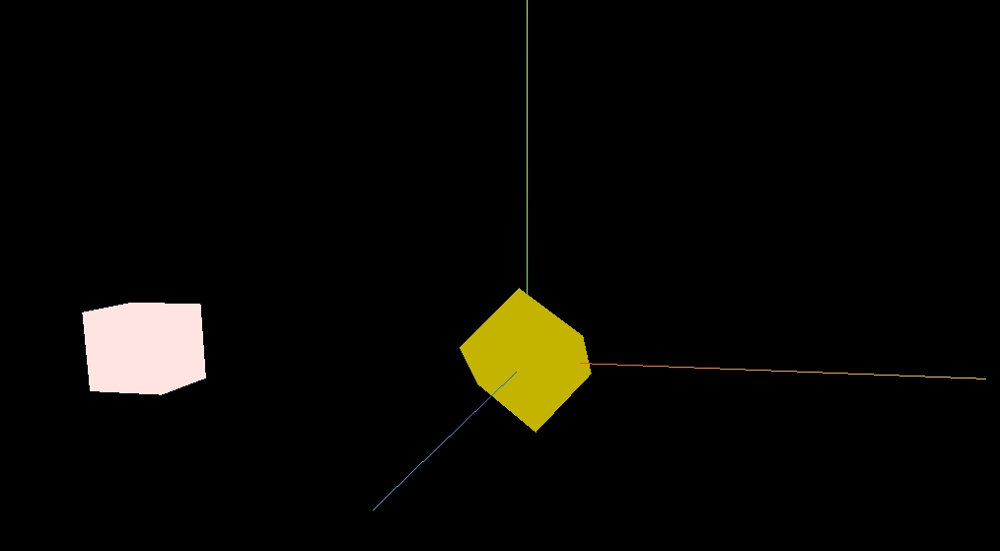

无废话，纯教程。
## 项目初始化
新建一个项目，npm初始化，终端执行命令

```js
npm init -y
```

安装依赖 `three` 和 `vite`

1. `npm install three --save`
2. `npm install vite -D`

package.json 添加`script`

```json
{
  "dev": "vite"
}
```

main.js 中引入 three

```js
import * as THREE from "three"
```

### 三要素

初始化三要素

1. 场景
2. 相机
3. 渲染器


我的个人理解，场景是 three.js 应用展示的平台，相机是用户视角，渲染器是将场景渲染出来。

### 场景
```js
const scene = new THREE.Scene();
```

### 相机
```js
const camera = new THREE.PerspectiveCamera(
  75,
  window.innerWidth / window.innerHeight,
  0.1,
  1000
);
camera.position.set(5, 0, 0);
camera.lookAt(0, 0, 0);
```

上面代码，调用了`three`的`PerspectiveCamera`方法创建一个透视相机，透视相机的特点是近大远小，符合人的视觉特点。其中`PerspectiveCamera`的参数第 1 个是视角，第 2 个是宽高比，第3 个是近平面， 第 4 个是远平面。然后通过`set`方法设置相机的位置，参数依次是x,y,z坐标轴，`lookAt`设置相机的观察点，这里设置的原点。

### 渲染器
```js
const renderer = new THREE.WebGLRenderer();
renderer.setSize(window.innerWidth, window.innerHeight);
document.body.appendChild(renderer.domElement);
```

创建渲染器，设置渲染器的尺寸为视口宽高，并将渲染结果也就是生成的 canvas 添加到页面结构中。
至此在浏览器页面结构中可以看到一个全屏大小的 canvas 元素，但此时页面上是空白的，这就需要在 canvas 场景上添加需要展示的东西。


## 盒子

添加一个正方体盒子

### 几何形状

新建一个长宽高为 1 的几何体
```js
const geometry = new THREE.BoxGeometry(1, 1, 1);
```

### 材质

设置材质，颜色为屎黄色（16进制）

```js
const material = new THREE.MeshBasicMaterial({
  color: 0x00ff00,
});
```

`MeshBasicMaterial`：基础网格材质。一个以简单着色（平面或线框）方式来绘制几何体的材质。

官方还提供了很多材质，查看地址：https://threejs.org/docs/index.html#api/en/materials/MeshBasicMaterial

### 立方体

有了几何形状和材质，就可以生成物品
```js
const cube = new THREE.Mesh(geometry, material);
```

然后将物品添加到场景中
```js
scene.add(cube);
```

最后，通过渲染器，渲染出场景
```js
renderer.render(scene, camera);
```

这样就能在场景中看到黑色背景下有一个屎黄色的正方体，由于摄像机视角的缘故，只能看到一个正方形。


### 动起来

可以写一个运动函数来让正方体动起来
```js
function animate() {
  requestAnimationFrame(animate);
  cube.rotation.x += 0.01;
  cube.rotation.y += 0.01;
  renderer.render(scene, camera);
}
animate();
```

上面代码，让物品cube的 x 轴和 y 轴方向旋转，每次更新后的位置都要重新渲染。通过`requestAnimationFrame`指定回调函数更新动画，以此让正方体一直转起来。


**完整代码**：
```js
import * as THREE from "three";
const scene = new THREE.Scene();
const camera = new THREE.PerspectiveCamera(
  45,
  window.innerWidth / window.innerHeight,
  0.1,
  1000
);
camera.position.set(0, 0, 10);
camera.lookAt(0, 0, 0);
const renderer = new THREE.WebGLRenderer();
renderer.setSize(window.innerWidth, window.innerHeight);
document.body.appendChild(renderer.domElement);
const geometry = new THREE.BoxGeometry(1, 1, 1);
const material = new THREE.MeshBasicMaterial({
  color: 80000000,
});
const cube = new THREE.Mesh(geometry, material);
scene.add(cube);
function animate() {
  requestAnimationFrame(animate);
  cube.rotation.x += 0.01;
  cube.rotation.y += 0.01;
  renderer.render(scene, camera);
}
animate();
```

## 开发辅助

现在场景中的正方体是固定视角，在开发过程中无法得知正方体的具体位置，也无法不同视角来观察，因此需要添加**世界坐标辅助器**和**轨道控制器**。

添加以下代码，
```js
const axesHelper = new THREE.AxesHelper(5);
scene.add(axesHelper);
const control = new OrbitControls(camera, renderer.domElement);
function animate() {
  control.update();
  requestAnimationFrame(animate);
  cube.rotation.x += 0.01;
  cube.rotation.y += 0.01;
  renderer.render(scene, camera);
}
animate();
```

以上代码，`AxesHelper`添加坐标辅助器，红色代表 X 轴. 绿色代表 Y 轴. 蓝色代表 Z 轴。轨道控制器是需要单独引入 three 封装的其他库。
```js
import { OrbitControls } from "three/examples/jsm/controls/OrbitControls";
```

还需要调整相机的位置，偏移一点方便直观看坐标系
```js
camera.position.set(2, 2, 10);
```

再到浏览器中查看，已经添加了三色的坐标辅助器，也可以通过鼠标来控制不同视角观察，滑动滚轮可以放大缩小，但需要的注意的是这里的缩放不是针对物体，而是整个场景世界，可以看到缩放时辅助坐标轴也缩放了。


## 父子元素
设置当前立方体元素的位置，
```js
cube.position.set(5, 0, 0);
```
x 轴方向为 5，此时是以原点为基准点计算，相当于父元素是整个场景，也就是**世界坐标**。


当设置一个父元素时，修改成如下代码，
```js
const geometry = new THREE.BoxGeometry(1, 1, 1);
const material = new THREE.MeshBasicMaterial({
  color: 80000000,
});
const cube = new THREE.Mesh(geometry, material);

const parent_material = new THREE.MeshBasicMaterial({
  color: "#FFE4E1",
});
const parent_cube = new THREE.Mesh(geometry, parent_material);
parent_cube.add(cube);

parent_cube.position.set(-5, 0, 0);
cube.position.set(5, 0, 0);
scene.add(parent_cube);
```

以上代码，原本的立方体`cube`，这里先称为子元素。使用相同几何体和不用颜色的相同材质，新建一个父元素`parent_cube`，通过`add`方法，将子元素加入到父元素，此时设置父元素的位置是 x 轴 -5 的坐标点，子元素仍然是 x 轴 5 的坐标点，那实际上子元素的位置，是基于父元素的位置计算，就是**局部坐标**。



我的个人理解，这里的子元素位置相当于 CSS 中设置了 `position: absolute`，当没有父元素的时候，是基于整个文档定位，当有父元素`position: relative`时依据父元素定位。

### 缩放和旋转

具体定义说明可以参考官网，https://threejs.org/docs/index.html#api/zh/core/Object3D.rotation

先将子元素的旋转动画停止
```js
function animate() {
  control.update();
  requestAnimationFrame(animate);
  // cube.rotation.x += 0.01;
  // cube.rotation.y += 0.01;
  renderer.render(scene, camera);
}
```

设置子元素放大，
```js
cube.scale.set(2, 2, 2);
```

子元素cube的 x,y,z 都放大 2 倍，明显能看出大了很多。


设置父元素放大 2 倍
```js
parent_cube.scale.set(2, 2, 2);
```

回到浏览器，可以发现父元素放大了 2 倍，但是子元素更大了，它在父元素的 2 倍基础上在乘上自己的放大 2 倍。


这里可以得出结论，父子元素间缩放关系，子元素会根据父元素的缩放倍数进行缩放。

设置子元素的旋转
```js
cube.rotation.x = Math.PI / 4;
```

子元素cube绕着 x 轴旋转 45°


设置父元素旋转
```js
parent_cube.rotation.x = Math.PI / 4;
```

父元素绕着 x 轴旋转 45°


可以发现，子元素也跟着旋转了，两次45°旋转又恢复了平行位置。

在 three [编辑器](https://threejs.org/editor/)，可视化来看一下


由此可以得出结论，父子间缩放和旋转的关系，子元素跟随父元素变化。
我的个人理解，可以将父子看成一个组合，当子元素加入到父元素时就形成了一个组，以父元素为基准，父元素缩放旋转都会带动整个组的变化，那组内的子元素自然就会相应的变化，但是子元素在组内如何的旋转缩放都不会影响到父元素，组员动弹不了组长。